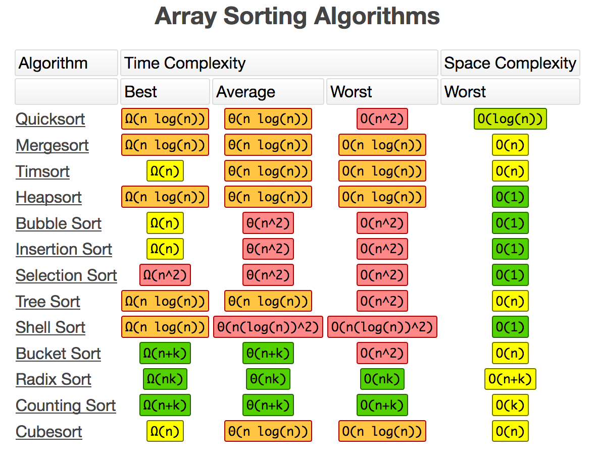
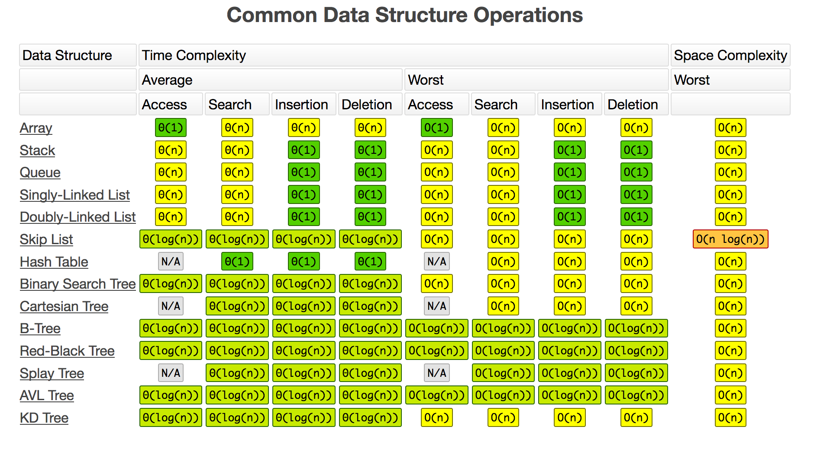

# Sandbox
## Practice Notes:
### Big-O Complexity
* O(n) - Linear Time 
* O(1) - Constant Time
* O(n^2) - Quadrant time





* Binary search - O(log(n))
* Linear search - O(n)
* Merge sort - O(n log(n))

| | ArrayList | LinkedList |
| --- | --- | --- |
| get() | O(1) | O(n) |
| add() | O(1) | O(1) amortized |
| remove() | O(n) | O(n) |

### Stacks & Queues
* Stacks => FIFO (first in first out) - push, pop, peek
* Queue => LILO (last in last out) - enqueue, dequeue
* How is stack implemented => ArrayList
* How queue is implemented => LinkedList

### Hashtables
**Source**: [https://www.geeksforgeeks.org/implementing-our-own-hash-table-with-separate-chaining-in-java/] (https://www.geeksforgeeks.org/implementing-our-own-hash-table-with-separate-chaining-in-java/)

* It is similar to HashMap, but is synchronised.
* Hashtable stores key/value pair in hash table.
* In Hashtable we specify an object that is used as a key, and the value we want to associate to that key. The key is then hashed, and the resulting hash code is used as the index at which the value is stored within the table.
* Common method calls - `Hashtable<Integer, String> ht = new Hashtable<Integer, String>();`
 * ht.contains("value");
 * ht.containsKey("keyValue");
 * ht.containsValue(value);
 * ht.entrySet();

```java
// creating a hash table 
Hashtable<Integer, String> h = new Hashtable<Integer, String>(); 
Hashtable<Integer, String> h1 = new Hashtable<Integer, String>(); 
  
h.put(3, "Geeks"); 
h.put(2, "forGeeks"); 
h.put(1, "isBest"); 
  
// create a clone or shallow copy of hash table h 
h1 = (Hashtable<Integer, String>)h.clone(); 

// clear hash table h 
h.clear(); 

```

```java
// create a table and add some values 
Map<String, Integer> table = new Hashtable<>(); 
table.put("Pen", 10); 
table.put("Book", 500); 
table.put("Clothes", 400); 
table.put("Mobile", 5000); 
  
// provide value for new key which is absent 
// using computeIfAbsent method 
table.computeIfAbsent("newPen", k -> 600); 
table.computeIfAbsent("newBook", k -> 800); 
```
#### Hashtable vs HashMap
* Hashtable is synchronized, whereas HashMap is not. This makes HashMap better for non-threaded applications, as unsynchronized Objects typically perform better than synchronized ones.
* Hashtable does not allow null keys or values. HashMap allows one null key and any number of null values.
* One of HashMap's subclasses is LinkedHashMap, so in the event that you'd want predictable iteration order (which is insertion order by default), you could easily swap out the HashMap for a LinkedHashMap. This wouldn't be as easy if you were using Hashtable.

### Sorts
#### Merge Sort
**Source**: [https://www.geeksforgeeks.org/merge-sort/](https://www.geeksforgeeks.org/merge-sort/)

```
MergeSort(arr[], l,  r)
If r > l
     1. Find the middle point to divide the array into two halves:  
             middle m = (l+r)/2
     2. Call mergeSort for first half:   
             Call mergeSort(arr, l, m)
     3. Call mergeSort for second half:
             Call mergeSort(arr, m+1, r)
     4. Merge the two halves sorted in step 2 and 3:
             Call merge(arr, l, m, r)
```

#### QuickSort
**Source** [https://www.geeksforgeeks.org/quick-sort/](https://www.geeksforgeeks.org/quick-sort/)

```
/* low  --> Starting index,  high  --> Ending index */
quickSort(arr[], low, high)
{
    if (low < high)
    {
        /* pi is partitioning index, arr[pi] is now
           at right place */
        pi = partition(arr, low, high);

        quickSort(arr, low, pi - 1);  // Before pi
        quickSort(arr, pi + 1, high); // After pi
    }
}
```

### General Links
* [Guava Library in Java](https://www.geeksforgeeks.org/guava-library-java/)
* [Dijkstra's shortest path Algorithm](https://www.geeksforgeeks.org/dijkstras-shortest-path-algorithm-in-java-using-priorityqueue/)
* [A* Search Algorithm](https://www.geeksforgeeks.org/a-search-algorithm/)
* [NP-complete problems](https://www.britannica.com/science/NP-complete-problem)
  * [Travelling Salesman Problem](https://www.geeksforgeeks.org/travelling-salesman-problem-set-1/)
  * [Knapsack Problem](https://www.geeksforgeeks.org/0-1-knapsack-problem-dp-10/)
* Operating Systems
  * [Java Concurrency](https://www.vogella.com/tutorials/JavaConcurrency/article.html)
  * [mutex-vs-semaphore](https://www.geeksforgeeks.org/mutex-vs-semaphore/)
  * [deadlock and livelock](https://www.geeksforgeeks.org/deadlock-starvation-and-livelock/) - [Avoiding them](https://www.geeksforgeeks.org/deadlock-prevention/)

## Setup to use services:
* Download & Install Java
* Download & Install latest version of maven

To utilize AWS Services

* Create a file with the contents below called `credentials` and store it in `~/.aws/credentials`

```
    # Move this credentials file to (~/.aws/credentials)
    # after you fill in your access and secret keys in the default profile
    # WARNING: To avoid accidental leakage of your credentials,
    #          DO NOT keep this file in your source directory.
    [default]
    aws_access_key_id=
    aws_secret_access_key=
```
* Specify your `access key id` and `secret access key` values in the file above

